# CryptoLab: Cipher and Algorithm Examples #

### AES ###
### Electronic Codebook ###
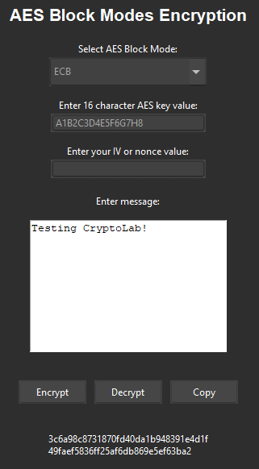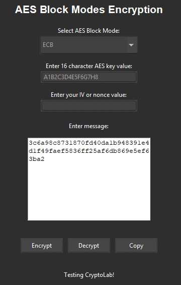
### Cipher Block Chaining Mode ### 

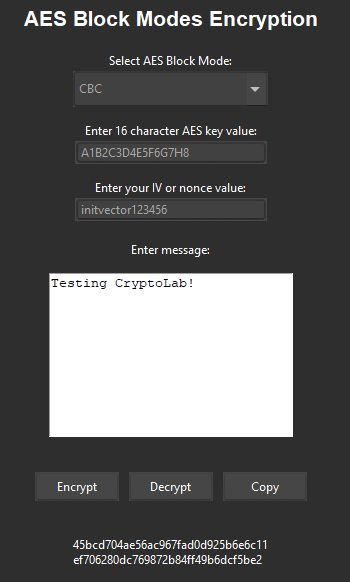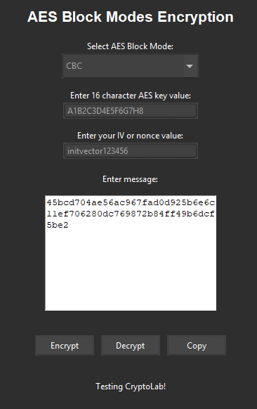
### Counter Mode ###

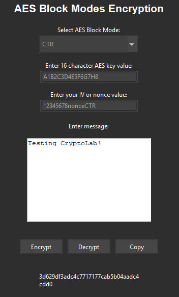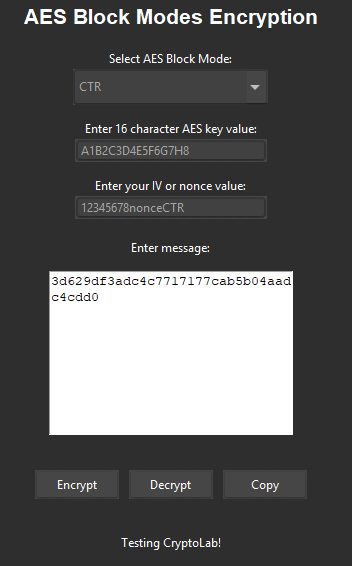

### Caesar Cipher ###

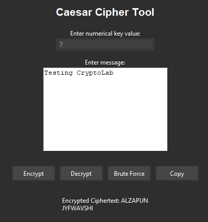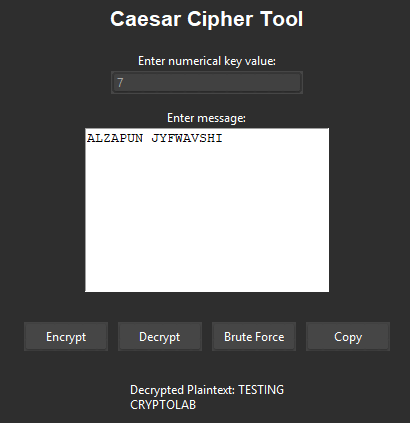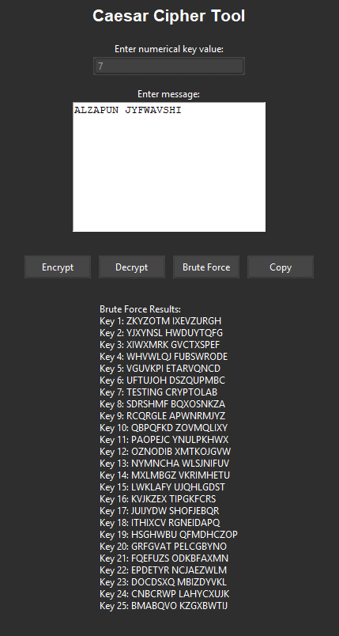

### DES Encryption ###

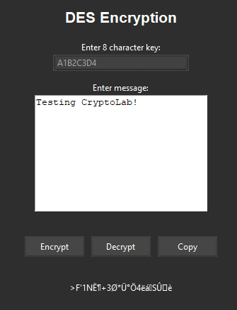
### Diffie Hellman ###

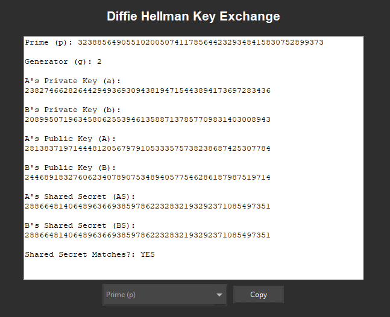

### Feistel Encryption ###

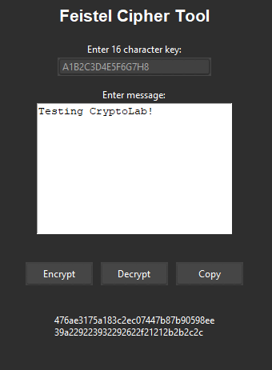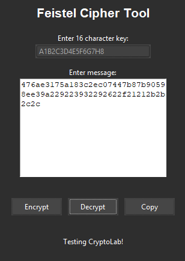

### Hill Cipher ### 

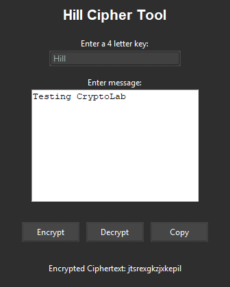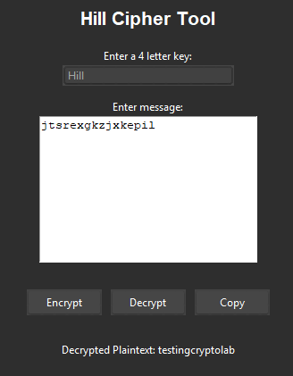

### Monoalphabetic Cipher ###

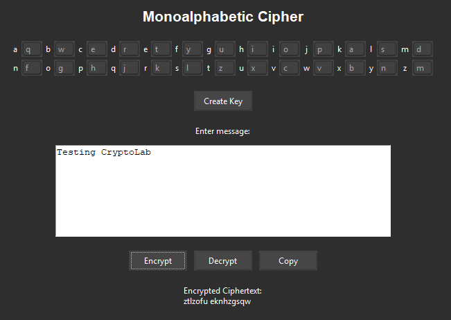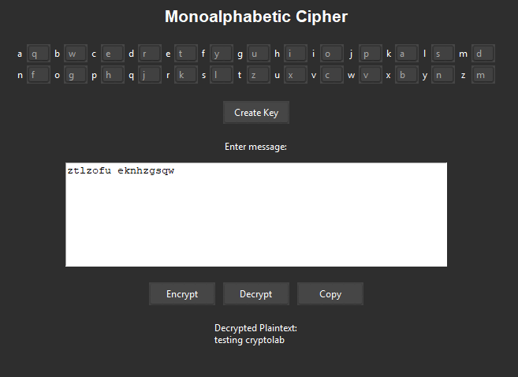

### Playfair Cipher ### 

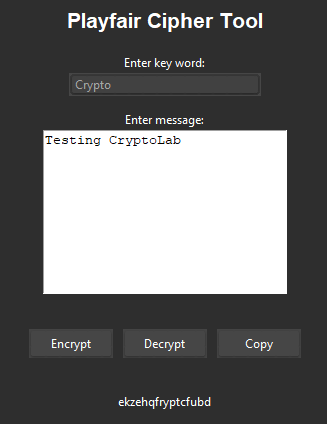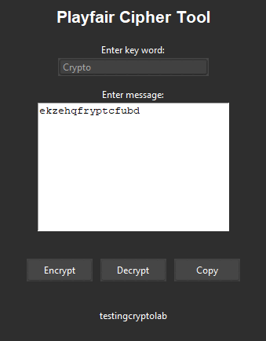

### RSA ###

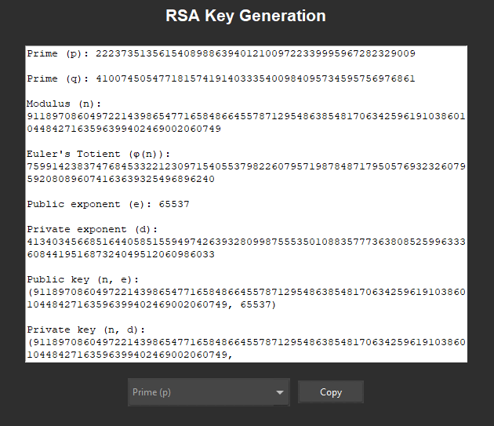

### Vernam Cipher ###

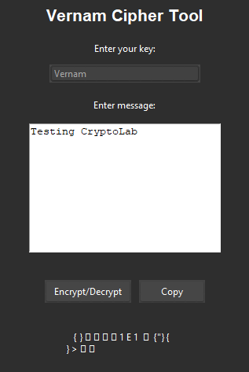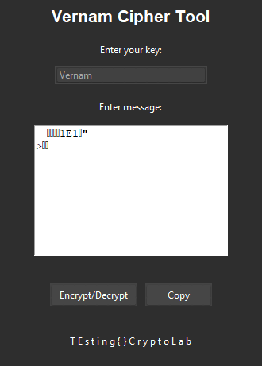

### Vigenere Cipher ###

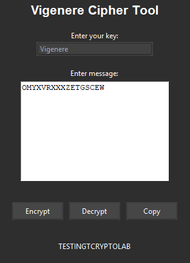
