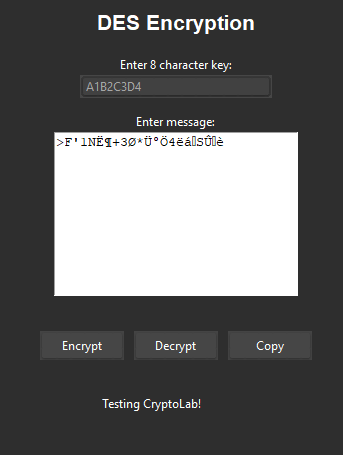
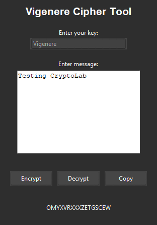

# CryptoLab: Cipher and Algorithm Examples #

### AES ###
### Electronic Codebook ###

### Cipher Block Chaining Mode ### 

### Counter Mode ###

### Caesar Cipher ###

### DES Encryption ###

### Diffie Hellman ###

### Feistel Encryption ###

### Hill Cipher ### 

### Monoalphabetic Cipher ###

### Playfair Cipher ### 

### RSA ###

### Vernam Cipher ###

### Vigenere Cipher ###

