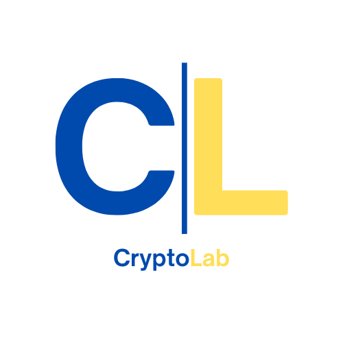

<div align="center">
  
</div>

# CryptoLab: A Comprehensive Cryptographic Tool #
## Overview ##
<p>CryptoLab is an interactive cryptographic toolkit designed to offer a hands-on learning experience for exploring various classical and modern encryption techniques. The application provides an intuitive graphical user interface (GUI) built using Python's Tkinter library, allowing users to experiment with a wide range of encryption methods in a visual and easy-to-understand manner.</p>

<p>Whether you're a student, teacher, hobbyist, or cryptography enthusiast, CryptoLab enables you to understand and implement encryption algorithms while demystifying the underlying mathematical principles. This tool is perfect for both learning and teaching cryptography concepts such as modular arithmetic, matrix operations, substitution ciphers, and more.</p>

## Ciphers and Algorithms ##

<p>CryptoLab integrates a diverse collection of cryptographic algorithms, both classical and modern, that are widely used in encryption and data security. Each algorithm is presented in a separate tab, allowing users to quickly navigate between ciphers and understand their mechanics.</p>

### AES Block Modes ###
<p>AES (Advanced Encryption Standard) is a symmetric block cipher used to encrypt data in 128-bit blocks. Block modes like ECB, CBC, and CTR define how these blocks are encrypted and interconnected</p>

- Key requirements: 128-bits or 16 character key
- Message: Encrypts 128-bit blocks, also 16 characters
- Modes:
    - ECB: Encrypts each block independently, making it fast but insecure due to pattern leakage in repeating data.
    - CBC: Chains each block with the previous ciphertext block using an IV, improving security but requiring padding.
    - CTR: Turns AES into a stream cipher by combining plaintext with a keystream generated from a nonce and counter, allowing parallel processing without padding.
- Nonce or IV: 
    - IV example: "initvector123456"
    - Nonce example: "12345678nonceCTR"

### Caesar Cipher ###
<p>A substitution cipher where each letter in the plaintext is shifted a fixed number of positions in the alphabet (e.g., shift of 3: A → D, B → E). It's simple but easily broken.</p>

- Key requirements: Key should be an integer 1-25 to shift the characters
- Message requirements: Will only encrypt letters, not numbers and other characters

### DES Encryption ###
<p>Data Encryption Standard is a symmetric-key algorithm using a 56-bit key to encrypt 64-bit blocks of data. It uses a Feistel structure with 16 rounds. Now considered insecure due to its small key size.</p>

- Key requirements: 64-bit or 8 character key reduced to 56 bits
- Message requirements: Encrypts 64-bit blocks

### Diffie Hellman Key Exchange ###
<p>A cryptographic protocol that allows two parties to securely share a secret key over an insecure channel. It uses modular arithmetic and the difficulty of the discrete logarithm problem.</p>

### Feister Cipher ###
<p>A design model for block ciphers that splits data into two halves and repeatedly applies round functions and swapping. DES is a classic example of a Feistel cipher.</p>

- Key requirements: 128-bit key or 16 characters
- Message requirements: 128-bit blocks or 16 character blocks

### Hill Cipher ###
<p>A polygraphic substitution cipher that uses linear algebra—plaintext is converted into vectors and multiplied by a key matrix modulo 26. Requires matrix inverses to decrypt.</p>

- Key requirements: Uses a 4 letter word arranged in a matrix
- Message requirements: Can only encrypt/decrypt letters

### Monoalphabetic Cipher ###
<p>A substitution cipher where each letter of the plaintext maps to a unique letter of ciphertext using a fixed substitution rule. More secure than Caesar but still vulnerable to frequency analysis.</p>

- Key requirements: Key is another set of characters mapped to the alphabet. Requires one character for each letter A-Z.
- Message requirements: Can only be letters.

### Playfair Cipher ###
<p>A digraph substitution cipher that encrypts pairs of letters using a 5x5 matrix of letters built from a keyword. It obscures letter frequency better than monoalphabetic ciphers.</p>

- Key requirements: Uses a single keyword applied to a 5x5 matrix
- Message requirements: Must only be letters. I & J are treated as one character

### RSA Key Generation ###
<p>A public-key cryptographic algorithm where key pairs are generated using two large prime numbers. The public key (e, n) is used for encryption, and the private key (d, n) for decryption. Security is based on the difficulty of factoring large numbers.</p>

### Vernam Cipher ###
<p>A one-time pad cipher where plaintext is combined with a random key of the same length using XOR. If the key is truly random and used only once, it offers perfect secrecy.</p>

- Key requirements: Can be any keyword, but will be made the same length as the message.
- Message requirements: No requirements.

### Vigenere Cipher ###
<p>A polyalphabetic cipher that uses a keyword to shift letters of the plaintext. Each letter of the keyword determines a Caesar shift, making frequency analysis harder than monoalphabetic ciphers.</p>

- Key requirements: Keyword is repeated to match the length of the message.
- Message requirements: Must be letters only.

## Installation ##

```
# Clone the repository
git clone https://github.com/jmhrusti/CryptoLab.git

# Navigate into the project folder
cd CryptoLab

# Install dependencies
pip install -r requirements.txt

# Run the application
python cryptolab.py
```

## Usage ##
<p>To use the application, run using the commands above. Then, select the tab of the algorithm that you would like to use from the tabs on top of the window. Enter your key and message to encrypt or decrypt the message. The copy button allows you to copy the output of the encryption or decryption. Please view the <a href="Examples.md">Examples.md</a> file to see examples of how to use each algorithm.</p>


## Contact ##

<p> If you have questions, comments, or concerns about this code, please reach out to <a href="mailto:jmhrustich@proton.me">jmhrustich@proton.me</a>.

## About ##

<p align="center"> This project was developed by Computer Science and Cybersecurity students John Hrustich, Christopher Rawlins, and Kate Vaughan at Utica University.</p>
<p align="center"> Created as a part of CSC 432 - Computer and Network Security | Spring 2025</p>
<p align="center"> Copyright 2025.</p>
